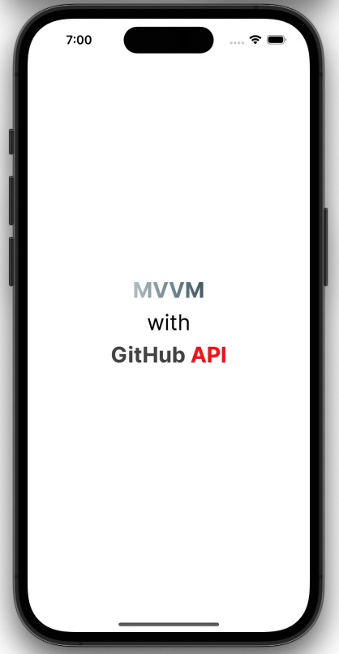
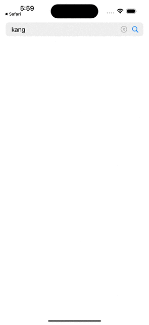
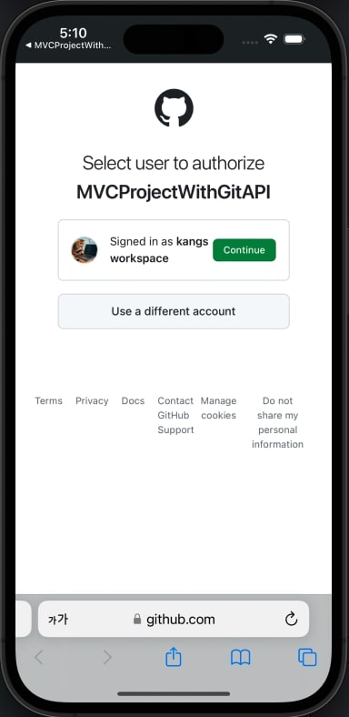
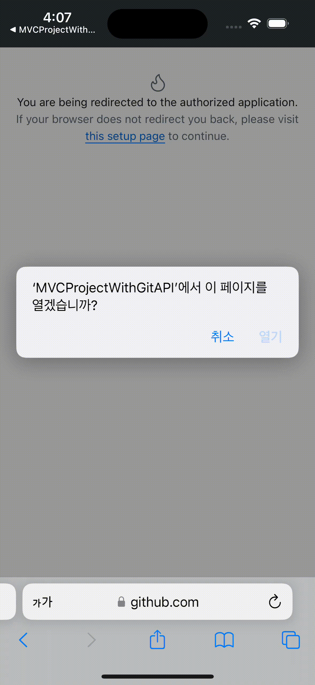
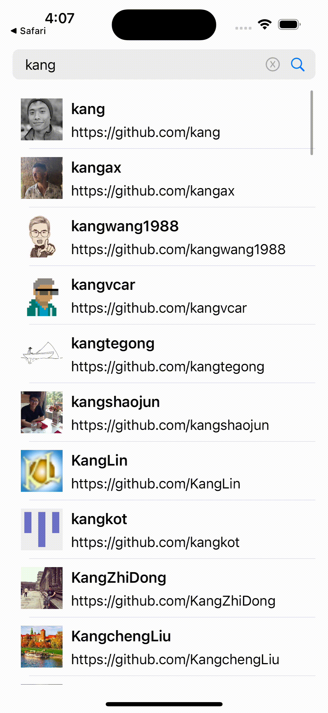

# MVVMProjectWithGitAPI

  

### 프로젝트 소개(ProjectWithGitAPI)  
이전에 혼자 진행한 작은 프로젝트를 디자인 패턴을 맞추는 것에 중점을 두고 다시 프로젝트를 구성했습니다.  
당시에는 `MVVM` 아키텍처로 구현했었지만 진행하는 과정에서 스스로 디자인 패턴에 대한 이해도가 부족하다고 느꼈습니다.  
<br>
그래서 디자인 패턴을 다시 학습한 후 동일한 기능을 다양한 디자인 패턴으로 구현하는 프로젝트를 진행하고 있습니다.  
해당 프로젝트는 규모가 작지만, `API 사용`, `네트워킹`, `이미지 Caching`, `페이징 처리` 등 학습한 기술들을 적극 활용할 수 있었습니다.  
그래서 **ProjectWithGitAPI** 라는 이름으로 디자인 패턴을 공부하기 위한 프로젝트로 채택하게 되었습니다.

### 학습한 내용(MVVM + RxSwift)  
#### RxSwift
- `MVVM` 패턴의 바인딩 처리와 비동기 처리를 위해 `RxSwift` 라이브러리를 학습하여 사용하게 되었습니다.  
- `Observable`, `Single`타입의 이벤트 스트림을 생성하고  
  `Subscribe`, `Bind`, `Drive` 를 통해 구독하였습니다.  
  특히 `Bind`, `Drive`는 메인스레드에서 동작을 보장하기 때문에 주로 UI와 관련된 곳에서 사용하였습니다.  
- 하나의 이벤트 스트림에 다수의 구독자가 구독할 수 있다는 점에서 이벤트 처리에 대한 코드의 유연성이 높다고 느꼈습니다.   
  유저 데이터를 `TableView` 데이터 설정과 빈 화면을 보여주는 `EmptyView`에서 각각 구독할 수 있었습니다.   

#### MVVM 패턴
- `View`는 **UI, 프레젠테이션 로직**을 담당하였습니다.  
- `ViewModel`은 `View`와 `Model`의 **중간 역할**과 **비즈니스 로직(뷰를 위한 로직, 뷰를 위한 데이터 처리)** 담당하였습니다.  
- `Model`은 **비즈니스 로직(데이터 fetch, entity 정의)** 을 담당하였습니다.  
- `View`에서 **데이터를 처리**하는 로직을 최소화하였습니다.  
   (유저의 `Input`은 `ViewModel`로 넘기기)  
   (`ViewModel`의 `Output`은 추가적인 데이터 처리 없이 `View`에서 사용하기)  
  
  

#### 느낀점
`MVVM` + `RxSwift`를 사용하며 Input과 Output만 신경쓰게 되면서 코드가 많이 정리되었습니다.  
저는 Input - Output이라는 큰 단위의 추상화가 되었다고 느꼈습니다.  
`MVC`에서는 Input에 대한 처리가 콜백함수로, 상대적으로 파편화 되어있었지만 이번 프로젝트에서는  
`bindViewModel()`, `bindView()` 함수로 Input에 대한 Output 처리가 모여있기 때문입니다.  
<br>
하지만 `MVVM` 패턴을 위해 `RxSwift`를 적용하며 오히려 코드가 늘어난 것도 느꼈습니다.  
`UIKit`은 시스템적으로 데이터 바인딩을 처리해주지 않기 때문에 RxSwift로 구현하면서 코드량이 증가한 거 같습니다.  
결과적으로 작은 프로젝트보다는 복잡한 프로젝트일수록 클로져로 할 일을 지정하는것보다 데이터 바인딩이 이점 클 거 같습니다.  

#### 트러블 슈팅(검색할 때 결과 없음을 알리는 뷰가 짧게 항상 보이는 문제)

  

- 문제: 검색 결과가 빈 값일 때 보여야하는 `EmptyView`가 검색할 때 항상 짧게 보입니다.
- 원인: 원인은 유저 데이터에 **기존의 값을 빈 배열로 값을 초기화** 하고나서 검색값이 할당되도록 코드가 작성되었기 때문입니다.  
       `EmptyView`는 유저 데이터를 구독하는데, 유저 데이터가 빈 값으로 초기화 될 때 `EmptyView`가 짧게 보이게 되었습니다.  
(기존 코드)
```swift
input.searchTrigger
    .flatMapLatest({[weak self] page -> Single<UserInfoList> in
        guard let self = self else { return Single.never() }
        let keyword = self.searchKeyword.value
        guard !keyword.isEmpty else { return Single.never() }

        // 새로운 검색어로 검색(page == 1)일 때 빈 값으로 초기화
        if page == 1 { self.userInfos.accept([]) }
        return self.networkProvider.fetchUserData(userID: keyword, page: page)
    })
    .map { $0.userInfo }
    .subscribe(onNext: {[weak self] userInfos in
        let value = self?.userInfos.value ?? []
        self?.userInfos.accept(value + userInfos)
    }).disposed(by: disposeBag)
```

해결:  
처음에는 비동기의 문제로 유저 데이터가 변하는 시점이 아니라 네트워킹이 끝나는 새로운 시점을 추가하려고 생각했습니다.  
`EmptyView`로직이 유저 데이터를 구독하면 데이터가 빈 값인 시점에 `EmptyView`가 보일 수 밖에 없기 때문입니다.  
<br>
그러다 빈 값으로 초기화하는 시점을 없애면 되지 않을까? 하는 생각이 떠올랐습니다.  
if문으로 각각의 상황에 맞게 바로 적용할 유저 데이터를 리턴하고 `.subscribe`에서 바로 할당하도록 하였습니다.  
**if문이 길어지졌지만 새로운 이벤트 스트림을 생성하고 처리하는 로직을 만들지 않게 되어 복잡성을 줄였습니다.**  

(해결 코드)  
```swift
input.searchTrigger
    .flatMapLatest({[weak self] page -> Single<UserInfoList> in
        guard let self = self else { return Single.never() }
        let keyword = self.searchKeyword.value
        guard !keyword.isEmpty else { return Single.never() }
        
        if page == 1 {
            return self.networkProvider.fetchUserData(userID: keyword, page: page)
        } else {
            return self.networkProvider.fetchUserData(userID: keyword, page: page)
                .map { userInfoList in
                    let currentInfos = self.userInfos.value
                    return UserInfoList(userInfo: currentInfos + userInfoList.userInfo)
                }
        }
    })
    .subscribe(onNext: { [weak self] userInfoList in
        self?.userInfos.accept(userInfoList.userInfo)
    }).disposed(by: disposeBag)
```

#### 아쉬운 점
  - 브랜치 수명이 길어 `TBD` 전략을 살리지 못했습니다.  
    이유를 생각해보니 초반에 브랜치 이름을 포괄적으로 해서 커밋이 많아지고 브랜치의 수명이 길어진 것 같습니다.  
  - 에러를 디버깅하며 세세한 에러처리가 많아졌습니다.  
    만약 규모가 큰 프로젝트였다면 추후 유지보수가 어려워 질 것 같습니다.  
    더 큰 단위에서 구조적으로 좋은 방법이 있나 고민을 하고 경험을 더 쌓아야 할 것 같습니다.  

### 작업 Flow - TBD(Trunk Based Develop)
  - 단일한 브랜치(Main or Trunk)에 수시로 병합(merge)
  - 브랜치의 수명을 가능한 짧게 가져감
  - [TBD에 대한 내용을 정리한 블로그](https://dev-kang.tistory.com/36)

### 개발 및 테스트 환경 버전
  - Xcode 15.3
  - iOS 16+
  - iPhone15 시뮬레이터
  - Portrait Only
  - LightMode Only 
### 프로젝트 실행 방법
```
프로젝트 빌드 시 Secrets.configs 파일이 필요합니다.
본 프로젝트 실행을 위해 파일이 필요할 시 spdlqjrkdrjs@naver.com으로 요청해주세요.
```
- git clone
```
git clone https://github.com/kangsworkspace/MVVMProjectWithGitAPI
```
- 현재 브랜치가 main에 있는지 확인하십시오.
- Simulator 기기를 iPhone15로 설정하고 빌드합니다.
<br>

### 구현 내용(구현 내용은 다른 ProjectWithGitAPI와 동일합니다)
 - <b> 깃 로그인 구현(임시 코드 및 access_token 획득) </b>
 
    
    
 
 - <b> 커스텀 SearchView 구현 </b>
 
  | |  | 
  |--|--|
 
 - <b> API사용, 페이징 처리, 이미지 캐싱처리 구현 </b>
    

 - <b> URL주소로 이동(SafariServices) </b>
  

## Library
- [RxSwift](https://github.com/ReactiveX/RxSwift): 비동기 처리/데이터 바인딩에 사용  
- [SnapKit](https://github.com/SnapKit/SnapKit): UI 레이아웃 잡는데 사용  
- [KingFisher](https://github.com/onevcat/Kingfisher): 이미지로 로드, 이미지 캐싱, 인디케이터에 사용   
- [Then](https://github.com/devxoul/Then): 코드 단축을 위해 사용  
- [Moya/RxMoya](https://github.com/Moya/Moya): 네트워킹에 사용  
